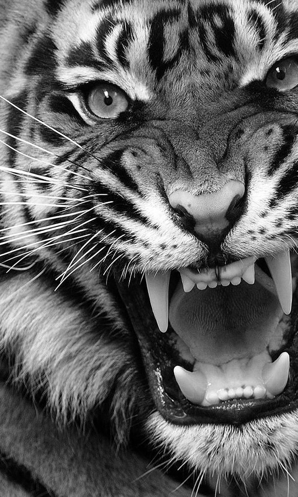
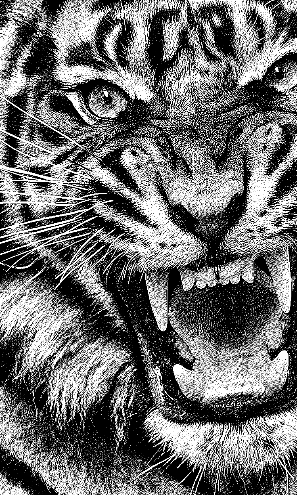

# Grayscale to Binary Engraving Dithering

Convert grayscale animal photos into pure binary black-and-white images in engraving/stipple style.

---

## Result — Shadow Push (run.py)

| Input | Output |
|-------|--------|
|  |  |

## Result — S-Curve (run_v2.py)

| Input | Output |
|-------|--------|
|  |  |

---

## Approach

Both scripts share the same JJN dithering core. They differ only in how the tone curve is applied before dithering — which controls how shadows cluster and how highlights open up.

### Shared Pipeline

**1. CLAHE (Contrast Limited Adaptive Histogram Equalization)**
Local contrast enhancement using an 8×8 tile grid. Unlike global histogram equalization, CLAHE enhances contrast independently per region — this recovers fine fur texture and whisker detail in dark shadow areas without blowing out highlights.

**2. Tone Mapping** *(differs between scripts — see below)*

**3. Unsharp Mask (Sharpening)**
A Gaussian blur is subtracted from the image with a strength of 1.5–1.6. This accentuates edges before dithering so that fur strands and fine lines survive binary quantization as distinct marks rather than blending into background noise.

**4. JJN Error Diffusion Dithering**
Jarvis-Judice-Ninke dithering spreads quantization error across 12 neighboring pixels in a wide fan pattern (2 rows deep, 5 columns wide). Compared to simpler algorithms like Floyd-Steinberg (7 neighbors), JJN produces finer, more organic dot texture that reads as stipple engraving rather than mechanical halftone. Each pixel is thresholded at 128 and the rounding error propagates forward — meaning every tone in the source is faithfully represented as a locally correct dot density in the output.

---

### Variant 1 — Shadow Push LUT (`run.py`)

A custom lookup table crushes pixels **below brightness 130** toward black using the curve `(i/130)^1.6 × 100`. Pixels at or above 130 pass through completely unchanged.

This creates dense black clusters in shadow regions while leaving mid-tones and highlights untouched — producing a high-contrast engraving look with fine detail preserved in fur and whiskers.

### Variant 2 — S-Curve LUT (`run_v2.py`)

A three-zone S-curve remaps the full tonal range:
- **Shadows (0–90):** compressed toward black at 0.4× scale
- **Midtones (90–166):** gently stretched for local contrast
- **Highlights (166–255):** pushed toward white

This affects the entire image more evenly than the shadow push, producing lighter overall density with more open white space in bright regions.

---

## Usage

```
pip install opencv-python pillow numpy
```

**Shadow Push variant:**
```
python scripts/run.py
```
Reads `images/input_grey.jpg` → writes `images/output_binary.png`

**S-Curve variant:**
```
python scripts/run_v2.py
```
Reads `images/input_grey.jpg` → writes `images/output_binary_V2.png`

Both scripts auto-resize any image wider than 1200px while preserving aspect ratio.

---

## Project Structure

```
├── README.md
├── images/                      ← Shadow Push variant
│   ├── input_grey.jpg
|   ├── output_binary_V2.png
│   └── output_binary.png

└── scripts/
    ├── run.py                   ← Shadow Push pipeline
    └── run_v2.py                ← S-Curve pipeline
```
